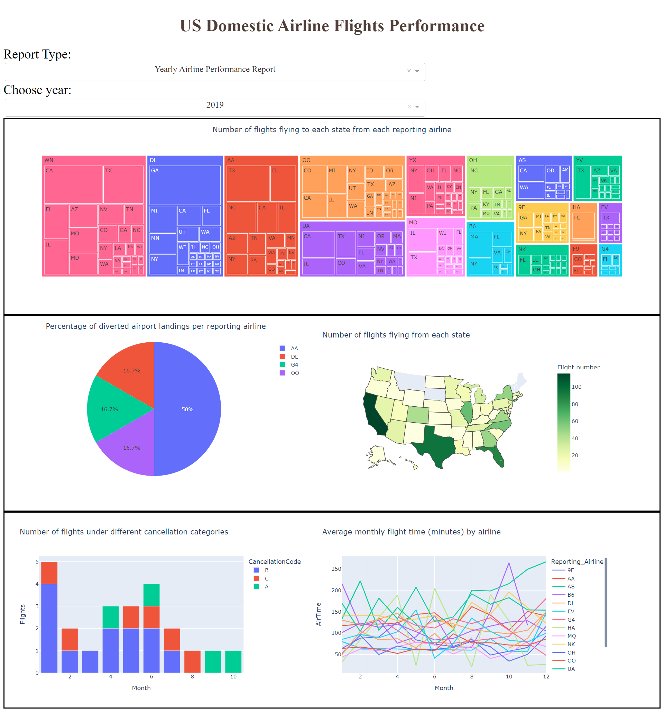

## Hands-on Practice Learning Lab for Data Science

### Overview 
* * *
This hands on practice lab is a part of [Data Visualization with Python](https://www.coursera.org/learn/python-for-data-visualization?) course offered by [Coursera.org](https://www.coursera.org/).

This repository presents step by step approach to create an interactive dashboard using Dash and Plotly graphing libraries. The analyses are carried on [Airline Reporting Carrier On-Time Performance dataset](https://developer.ibm.com/exchanges/data/all/airline/) from [Data Asset eXchange](https://developer.ibm.com/exchanges/data/?utm_medium=Exinfluencer&utm_source=Exinfluencer&utm_content=000026UJ&utm_term=10006555&utm_id=NA-SkillsNetwork-wwwcourseraorg-SkillsNetworkCoursesIBMDeveloperSkillsNetworkDV0101ENSkillsNetwork20297740-2021-01-01&cm_mmc=Email_Newsletter-_-Developer_Ed%2BTech-_-WW_WW-_-SkillsNetwork-Courses-IBMDeveloperSkillsNetwork-DV0101EN-SkillsNetwork-20297740&cm_mmca1=000026UJ&cm_mmca2=10006555&cm_mmca3=M12345678&cvosrc=email.Newsletter.M12345678&cvo_campaign=000026UJ)

✓ Link to the dataset: [Link](https://cf-courses-data.s3.us.cloud-object-storage.appdomain.cloud/IBMDeveloperSkillsNetwork-DV0101EN-SkillsNetwork/Data%20Files/airline_data.csv)  
✓ link to the glossary of the dataset [Link](https://dax-cdn.cdn.appdomain.cloud/dax-airline/1.0.1/data-preview/index.html?_ga=2.83976473.1025912384.1640558225-1040743284.1639660199)  
✓ Link to the notebook: [Link](https://github.com/Farhad-Davaripour/Dashboarding_with_Python/blob/main/Notebook.ipynb)   

## About The Author

- Farhad Davaripour is a finite element specialist/data science enthusiast with near 3 years of experience working in research and development roles. He has a knack for problem-solving and passion for data science (He is certified with [IBM Data Science Professional Certificate](https://coursera.org/share/d7d1a76ed251437131fd33bba91bb9d9)).
- Connect with Farhad on [LinkedIn](https://www.linkedin.com/in/farhad-davaripour/).
